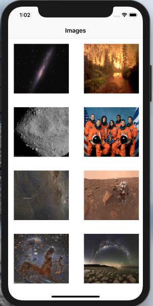

# AMP

The threads allow you to perform the instructions of a process by following their own call stack. Initially a process is started on a single thread, the main thread.

Using multiple threads allows you to parallelize the processing of multiple functions to run code in background. This point is extremely important on iOS to avoid blocking the user interface (UI) while the application is making calculations or waiting for a server to respond.

This willteach you how to:

• use a collection view
• do a multithread on iOS
• create alerts
• use a scroll view

# Screanshots

 
 